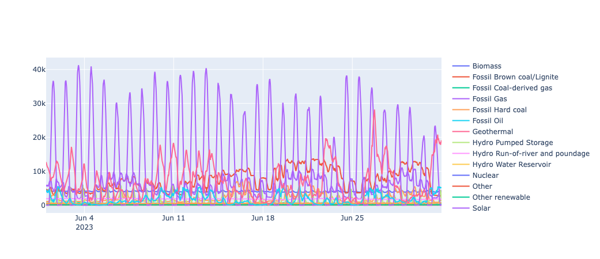
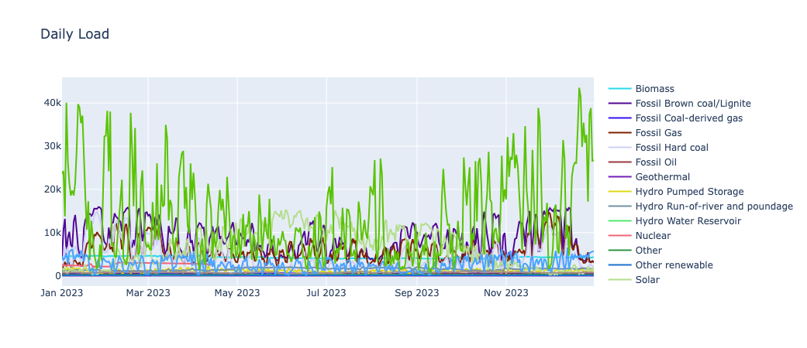
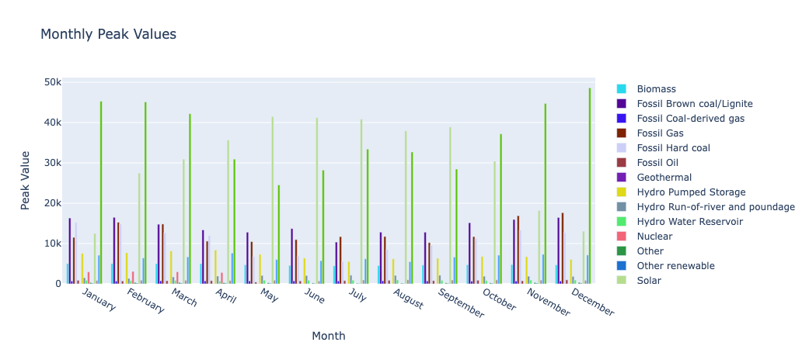
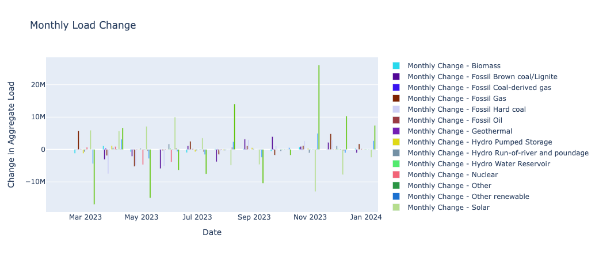
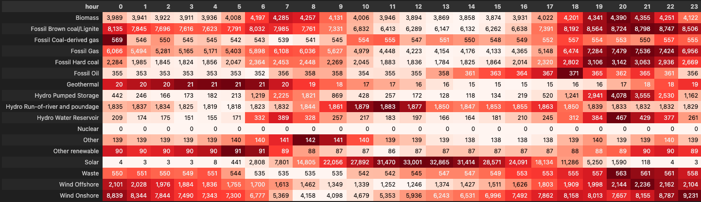

## Description

The ENTSO-E Data Analysis is designed to facilitate a seamless operation in handling, visualising, and analysing electricity market and grid data across Europe [European Network of Transmission System Operators for Electricity(ENTSO-E)](https://transparency.entsoe.eu/)

## Features

- **Data Visualisation:** Visualise time series data with plots to analyse daily means, monthly peaks, and changes.

### Prerequisites

- Python 3.10
- Pandas 2.1.2
- Plotly 5.18.0
- Entsoe-py   

### Results

**A heat matrix to highlight the differences in generation by technology in Germany according to the time of day.(June 2023)**

