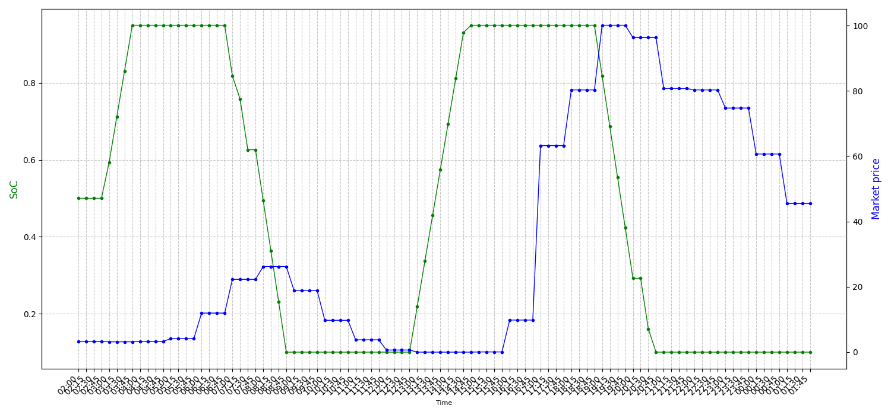

## Description

This project provides a dockerised Python application for optimising Battery Energy Storage System (BESS) operations. It fetches real-time energy market data and uses a linear programming solver (OR-Tools) to determine optimal battery charging and discharging schedules.

## Features

* **SMARD Data Fetching:** Automatically retrieves market prices, load, wind, and solar generation data from the SMARD API for a specified day.
* **BESS Optimization:** Implements a Mixed-Integer Programming (MIP) model using Google OR-Tools to optimize battery operations (charging, discharging, state-of-charge) based on market conditions and battery/grid constraints.
* **Excel Output:** Saves detailed optimisation results (grid power flow, battery power, SOC, etc.) to an Excel file.
* **Plotting:** Generates a plot showing the State-of-Charge (SoC) and market price over time, saved as a PNG image.
* **Dockerised:** Encapsulates the entire application in a Docker container for easy setup, consistent execution, and portability across different environments.

## Project Structure
```bash
bess_optimizer_pipeline/
├── app/
│   ├── __init__.py         
│   ├── config.py           # Configuration settings (paths, API details, dates)
│   ├── smard_client.py     # Handles SMARD API data fetching and preprocessing
│   ├── bess_optimiser.py   # Contains the OR-Tools optimisation model
│   └── main.py             # Main entry point to run the pipeline
├── data/
│   └── BESS_Data.xlsx      # BESS and Grid parameters (REQUIRED)
├── requirements.txt        # Python dependencies
└── Dockerfile              # Instructions to build the Docker image
```
## Prerequisites

## Prerequisites

* [Install Docker Desktop](https://docs.docker.com/desktop/)

## Setup Instructions

1.  **Clone the Repository (or download the files):**
    ```bash
    git clone https://github.com/srirambadri/Energy.git
    cd BESS_optimiser
    ```
2.  **Building the Docker Image**
    ```bash
    docker build -t bess_optimiser_image .

## Running the Application

**Option 1: Run with Default Dates**
The config.py file automatically sets the SMARD data fetching period from the beginning of yesterday to the beginning of today.

**Option 2: Run with Custom Dates**
Specify the SMARD_START_DATE and SMARD_END_DATE using an smard_dates.env environment file.
```bash
# smard_dates.env
SMARD_START_DATE=YYYY-MM-DD HH:MM:SS
SMARD_END_DATE=YYYY-MM-DD HH:MM:SS
```
**Run the Docker Container:**
```bash
docker run -it --rm \
  -v "$(pwd)/output:/app/output" \
  --env-file ./smard_dates.env \
  bess_optimiser_image
```

