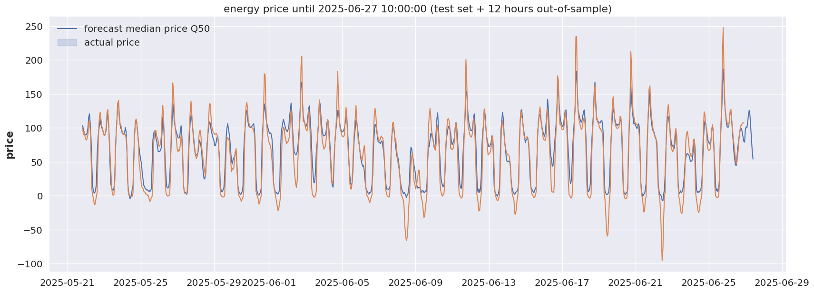
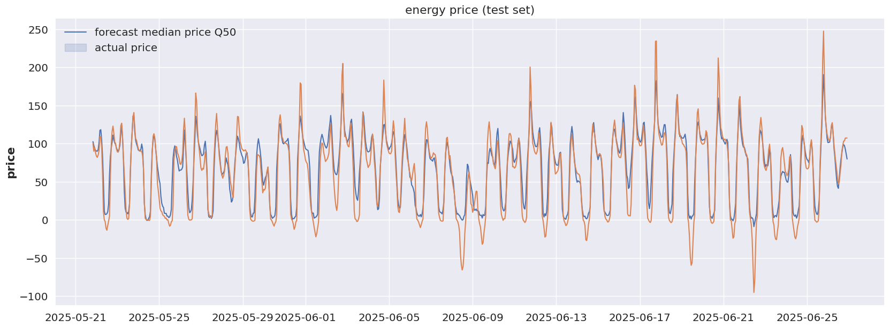

## Energy Price Forecaster

This project forecasts German energy day ahead prices using DARTS Timeseries forecasting library

### The models implemented are:

- The Transformer model
- Temporal Fusion Transformers (TFT)
- Neural Basis Expansion Analysis Time Series Forecasting (NBEATS)

### Results

