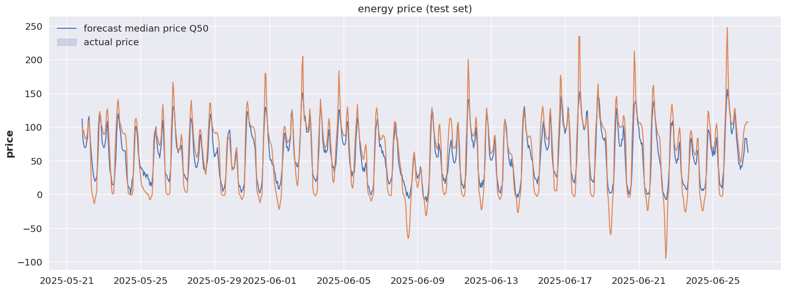
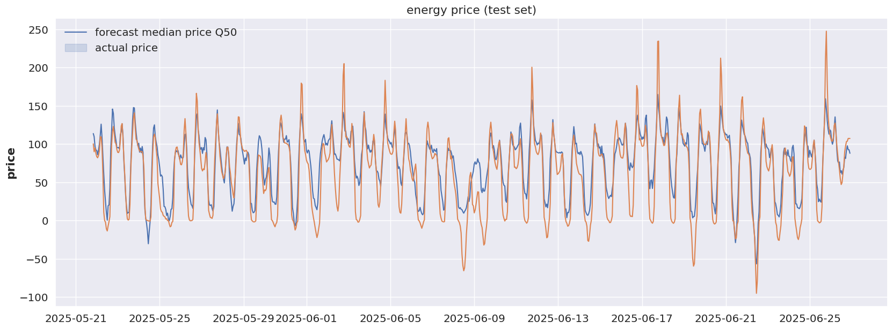

## Day-Ahead Energy Price Forecasting for Germany using DARTS

This project focuses on forecasting German day-ahead energy prices using the DARTS time series forecasting library. To enhance prediction accuracy, the model integrates comprehensive data on electricity generation sources and localised weather features from five key cities: Aachen, Berlin, Hamburg, Munich, and Stuttgart. The dataset combines energy production and pricing data from ENTSO-E with meteorological variables from OpenWeatherMap. By leveraging multi-variate time series modelling, the project captures complex temporal and spatial dependencies to generate robust price forecasts.

### The models implemented are:

- The Transformer model
- Temporal Fusion Transformers (TFT)
- Neural Basis Expansion Analysis Time Series Forecasting (NBEATS)

### Results

- Transformer

- TFT

- NBEATS

