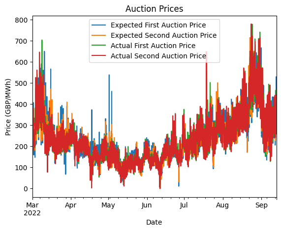
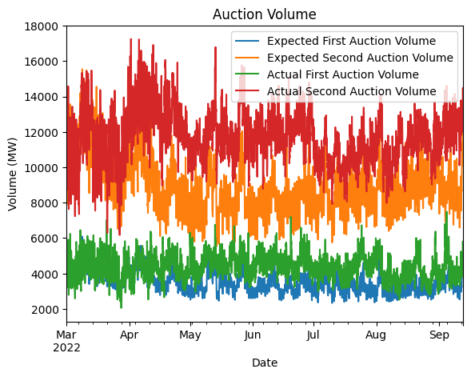
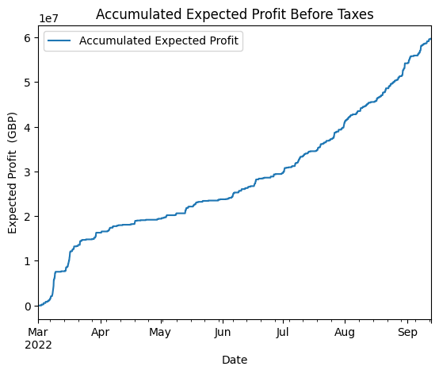

## Description

A ML-based methodology to forecast energy futures prices and volume, and subsequently develop a trading algorithm aimed at maximizing profits in the volatile energy market. It leverages historical auction data from the UK energy market to train and evaluate the models' performance


## Project Overview

The approach is structured around four main stages:

- Data Preprocessing: Cleaning, interpolating, and splitting historical UK auction data.

- Price Forecasting: Predicting future electricity prices and volumes using various models.

- Trading Decision-Making: Implementing a non-physical financial trading strategy based on forecasts to achieve a zero net position.

- Backtesting & Evaluation: Assessing model accuracy and strategy profitability using standard metrics.


## Poject Structure
```bash
Trading/
├── data/
│   ├── auction_data.csv          # Historical auction prices and traded volumes
│   ├── forecast_inputs.csv       # Features used for forecasting (e.g., weather, system data)
│   └── system_prices.csv         # Historical system prices
├── src/
│   ├── init.py               
│   ├── data_handler.py           # Handles data loading, preprocessing, and train-test splitting
│   ├── forecasting_models.py     # Implements various forecasting models and model averaging
│   ├── trading_strategy.py       # Contains the logic for trading decisions and bid generation
│   ├── evaluation.py             # Provides functions for calculating performance metrics and plotting results
│   └── main.py                   
├── requirements.txt              # Lists project dependencies
└── README.md                     # Project README file
```

## Setup and Installation

1.  **Clone the repository:**
    ```bash
    git clone https://github.com/srirambadri/energy.git
    cd Trading
    ```

2.  **Create a virtual environment (recommended):**
    ```bash
    python -m venv venv
    source venv/bin/activate
    ```

3.  **Install dependencies:**
    ```bash
    pip install -r requirements.txt
    ```

## Running the Trading Pipeline

To execute the full energy trading pipeline (data processing, forecasting, trading strategy, and evaluation):

```bash
python src/main.py
```

## Key Findings

The trading algorithm's reliance on precise forecasts is crucial, as overestimation or underestimation of auction prices can result in actual profits falling short of expectations, potentially impacting investor confidence and reputation. Model Averaging was identified as the most suitable forecasting model for this task







