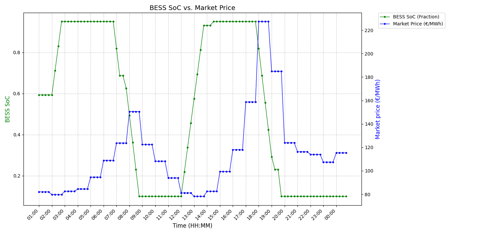
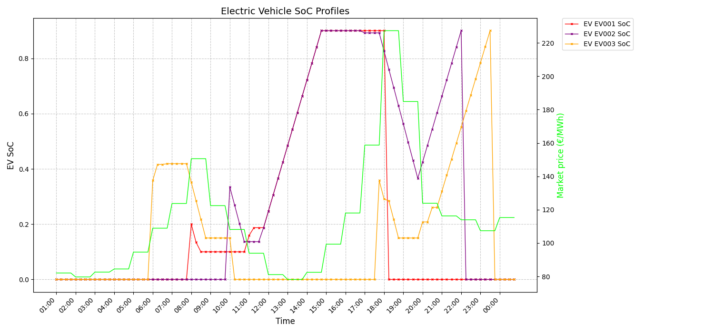

## Description

This project optimizes the operation of an Electric Vehicle (EV) charging hub by integrating renewable energy and Vehicle-to-Grid (V2G) capabilities. It aims to reduce EV charging costs for end-users and minimize strain on the distribution network by leveraging local solar power (PV) and Battery Energy Storage Systems (BESS).

Using Mixed-Integer Linear Programming (MILP), the model determines optimal power flow and operational strategies. It supports Smart Charging and V2G functionality, focusing on minimizing lifetime investment and operational costs while enhancing energy self-sufficiency.

## Data

**SMARD_data.csv:** Market prices, load, wind, and solar generation data

**BESS_Data.xlsx:** Parameters for BESS and grid connection limits

**EV.xlsx:** Static EV parameters (capacity, initial SoC, desired final SoC) and docking schedules

## Diagram

## Plots

The model generates two insightful plots:

**BESS SoC and Market Price:**

This plot illustrates the Battery Energy Storage System's State of Charge (SoC) alongside the Market Price of electricity over time. It typically shows the BESS charging when prices are low (e.g., overnight) and discharging when prices are high (e.g., peak demand), demonstrating its role in cost arbitrage and peak shaving.

**Electric Vehicle State of Charge Profiles:**

This plot displays the State of Charge (SoC) for each individual EV throughout the simulation. It visualizes charging activity when EVs are docked and maintaining desired charge levels. The optimization ensures each EV meets its desired_final_soe by departure, even with V2G participation where temporary discharge might occur to support the system during high-price periods.

